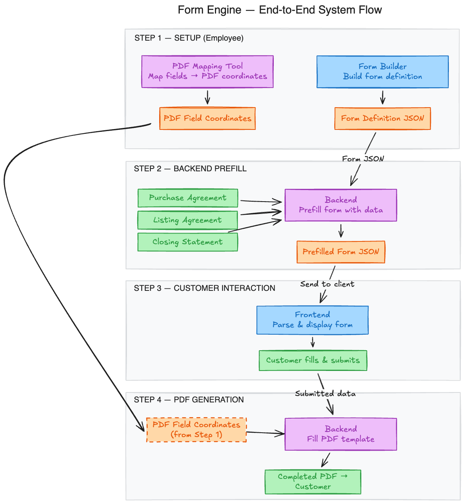

# Form Engine — System Design Document

## 1. System Overview

The Form Engine is a data-driven system for building, prefilling, rendering, and processing dynamic multi-step forms that ultimately produce completed PDF documents. It replaces hand-coded forms with a JSON-driven approach, enabling non-developers to create and modify forms without code changes.

### End-to-End Flow



The system involves **four major steps** spanning three actors: the **Employee** (setup), the **Backend** (processing), and the **Customer** (interaction).

| Step | Actor | Input | Output |
|------|-------|-------|--------|
| 1. PDF Mapping | Employee | Blank PDF template | PDF Field Coordinates |
| 2. Form Builder | Employee | Business requirements | Form Definition JSON |
| 3. Backend Prefill | Backend | Form JSON + data sources | Prefilled Form JSON |
| 4. Customer Interaction | Customer (Frontend) | Prefilled Form | Submitted form data |
| 5. PDF Generation | Backend | Coordinates + submitted data | Completed PDF |

---

## 2. Step 1 — PDF Mapping (Employee)

### Purpose

Before any form can generate a PDF, someone must define *where* each piece of data goes on the PDF template. This is the PDF Mapping step.

### How It Works

1. The employee opens the **PDF Mapping Tool** — a separate internal application.
2. They upload or select the **blank PDF template** (e.g., a Purchase Agreement PDF, a Listing Agreement PDF).
3. Using the tool's visual interface, they **click on locations** in the PDF where form data should be placed.
4. For each location, they assign a **field ID** that corresponds to a field in the form definition.
5. The tool outputs a **PDF Field Coordinates** mapping — a data structure that links each field ID to its `(x, y)` position, page number, font size, and other rendering properties on the PDF.

### Output: PDF Field Coordinates

```json
{
  "templateId": "purchase-agreement-v3",
  "fields": [
    {
      "fieldId": "buyerFirstName",
      "page": 1,
      "x": 150,
      "y": 320,
      "fontSize": 12,
      "maxWidth": 200
    },
    {
      "fieldId": "vesselPrice",
      "page": 2,
      "x": 400,
      "y": 185,
      "fontSize": 12,
      "format": "currency"
    }
  ]
}
```

This mapping is stored in the database and referenced later during PDF generation (Step 5).

---

## 3. Step 2 — Form Builder (Employee)

### Purpose

The employee designs the actual form that the customer will interact with. The Form Builder outputs a **Form Definition JSON** — a complete, serializable description of a multi-step form.

### How It Works

1. The employee opens the **Form Builder** application.
2. They create **steps** (pages/sections) for the form — e.g., "Vessel Information", "Buyer Details", "Financial Terms".
3. Within each step, they add **fields** by choosing from available field types and configuring their properties.
4. For each field, they configure:
   - **Label & placeholder** — what the customer sees
   - **Validation rules** — required, min/max length, email format, etc.
   - **Data mapping** — where to read prefill data from, and where to write submitted data to
   - **Layout** — column position and span within a responsive grid
   - **Conditional logic** — show/hide fields based on other field values
5. The builder outputs a **Form Definition JSON** that is stored in the database.

### Supported Field Types

| Type | Description | Example |
|------|-------------|---------|
| `text` | Standard text input | First Name, Address |
| `maskedText` | Formatted text input | Phone number (+1 (###) ###-####) |
| `number` | Numeric input | Price, Year |
| `email` | Email with validation | Contact email |
| `url` | URL with validation | Website |
| `selectSimple` | Dropdown (string value) | Year, Country |
| `selectObject` | Dropdown (object value with id+label) | Engine Type, Hull Material |
| `yachtMake` | Specialized make selector | Vessel make |
| `yachtModel` | Specialized model selector (depends on make) | Vessel model |
| `array` | Repeatable group of fields | Deposits, Co-buyers |
| `conditional` | Toggle or select that shows/hides branches | "Has trade-in?" → show trade-in fields |

### Output: Form Definition JSON (simplified)

```json
{
  "id": "form_purchase_agreement",
  "version": 1,
  "title": "Purchase Agreement",
  "steps": [
    {
      "id": "step_vessel_info",
      "name": "vessel_info",
      "title": "Vessel Information",
      "order": 0,
      "fields": [
        {
          "type": "text",
          "name": "firstName",
          "label": "First Name",
          "layout": { "column": 1, "colSpan": 6 },
          "dataMapping": {
            "prefillPath": "buyer.firstName",
            "submitPath": "buyer.firstName"
          },
          "validationSchema": [
            ["yup.string"],
            ["yup.required", "First name is required"],
            ["yup.max", 60]
          ]
        }
      ]
    }
  ]
}
```

### Key Design Decisions

- **Validation is defined as yup-ast** — JSON-serializable arrays that represent Yup validation schemas. This avoids the limitation of Zod's `refine`/`superRefine` not being serializable.
- **Conditional fields use flat naming** — child fields are siblings, not nested under the conditional's name, avoiding conflicts between the conditional's value (a string/boolean) and its children.
- **Selects support both static options and dynamic API endpoints** with optional infinite scroll for large datasets.

---

## 4. Step 3 — Backend Prefill

### Purpose

Before sending the form to the customer, the backend **prefills** known field values from existing data sources. This saves the customer from re-entering information that the system already has.

### Data Sources

The backend pulls prefill data from multiple sources depending on the form type:

| Data Source | Examples of Data |
|-------------|-----------------|
| **Purchase Agreement** | Vessel details, buyer info, broker info, price |
| **Listing Agreement** | Listing price, seller info, vessel specs |
| **Closing Statement** | Financial terms, deposits, adjustments |
| **User Profile** | Name, email, phone, address |
| **Vessel Database** | Make, model, year, HIN, specifications |

### How It Works

1. The backend loads the **Form Definition JSON** from the database.
2. For each field in the form, it reads the `dataMapping.prefillPath` property.
3. It looks up that path in the combined data from the relevant sources.
4. If a value is found, it sets that as the field's `defaultValue`.
5. The resulting **Prefilled Form JSON** is sent to the frontend.

### Example: Prefill in Action

Given a field definition:
```json
{
  "type": "email",
  "name": "buyerEmail",
  "label": "Buyer Email",
  "dataMapping": {
    "prefillPath": "buyer.contactInfo.email",
    "submitPath": "buyerInfo.email"
  }
}
```

And a data source containing:
```json
{
  "buyer": {
    "contactInfo": {
      "email": "john.doe@example.com"
    }
  }
}
```

The backend sets `defaultValue: "john.doe@example.com"` on that field before sending the form to the frontend. The customer sees the email pre-filled and can modify it if needed.

---

## 5. Step 4 — Customer Interaction (Frontend)

### Purpose

The frontend application receives the prefilled Form Definition JSON, **parses** it at runtime, and **renders** a fully interactive multi-step form for the customer to complete.

### How It Works

1. **Parse the JSON** — The frontend reads the form definition and constructs the UI dynamically.
2. **Build validation schemas** — For each step, the runtime:
   - Reads each field's `validationSchema` (yup-ast arrays)
   - Converts them to real Yup schemas using `@demvsystems/yup-ast`
   - For conditional fields, wraps branch children in `yup.when()` so validation is only active for the visible branch
   - Assembles into a step-level `yup.object().shape({...})`
   - Passes to `yupResolver` for `react-hook-form`
3. **Render fields** — Each field type maps to a specific React component (e.g., `text` → `FormTextField`, `selectObject` → `FormSelect`).
4. **Prefilled values** — Fields with `defaultValue` (set during prefill) appear pre-populated. The customer can review and modify them.
5. **Multi-step navigation** — The customer moves through steps, with per-step validation ensuring data integrity before advancing.
6. **Submit** — On final submission, the frontend collects all field values and maps them using `dataMapping.submitPath` to construct the outgoing payload. This is sent to the backend.

### Validation Example

A field defined as:
```json
"validationSchema": [
  ["yup.string"],
  ["yup.required", "Email is required"],
  ["yup.email", "Must be a valid email"]
]
```

Gets converted at runtime to:
```javascript
yup.string().required("Email is required").email("Must be a valid email")
```

### Conditional Validation

For a conditional field like "Has trade-in?":
```javascript
tradeInValue: yup.when("hasTradeIn", {
  is: true,
  then: yup.number().required("Trade-in value is required").min(1),
  otherwise: yup.mixed().nullable().optional()
})
```

Only when the customer toggles "Yes" does the trade-in value become required.

---

## 6. Step 5 — PDF Generation (Backend)

### Purpose

After the customer submits the form, the backend combines the **submitted data** with the **PDF Field Coordinates** (from Step 1) to produce a **completed PDF**.

### How It Works

1. The backend receives the **submitted form data** from the frontend.
2. It retrieves the **PDF Field Coordinates** mapping for the relevant PDF template (created in Step 1).
3. It loads the **blank PDF template** file.
4. For each coordinate entry, it:
   - Looks up the corresponding field value from the submitted data
   - Formats the value if needed (e.g., currency formatting, date formatting)
   - Writes the value onto the PDF at the specified `(x, y)` position, page, and font size
5. The completed PDF is saved and delivered to the **customer** (via download, email, or in-app).

### Example

Given submitted data:
```json
{
  "buyer": {
    "firstName": "John"
  }
}
```

And PDF coordinates:
```json
{
  "fieldId": "buyerFirstName",
  "page": 1,
  "x": 150,
  "y": 320,
  "fontSize": 12
}
```

The system writes "John" at position (150, 320) on page 1 of the PDF template.

---

## 7. Technical Details

### JSON Schema Structure

```
FormSchema
├── id, version, title
└── steps[]
    ├── id, name, title, order
    └── fields[]
        ├── id, type, name, label
        ├── layout: { column, colSpan, order }
        ├── dataMapping: { prefillPath, submitPath }
        ├── validationSchema: YupAst[]
        └── [type-specific properties]
```

### Validation: yup-ast

The system uses **yup-ast** (`@demvsystems/yup-ast`) to represent validation rules as JSON arrays. This is critical because:

- **Zod's `refine`/`superRefine`** cannot be serialized to JSON (they require JavaScript functions)
- **Yup's `.when()`** handles conditional validation natively and can be constructed from data
- **yup-ast** provides `transformAll()` to convert JSON arrays → real Yup schema objects

Each yup-ast node is a tuple: `[methodName, ...args]`

| Scenario | yup-ast |
|----------|---------|
| Required string, 2-60 chars | `[["yup.string"], ["yup.required", "..."], ["yup.min", 2], ["yup.max", 60]]` |
| Required number | `[["yup.number"], ["yup.required", "..."]]` |
| Required email | `[["yup.string"], ["yup.required", "..."], ["yup.email", "..."]]` |
| Optional URL | `[["yup.string"], ["yup.url", "..."], ["yup.nullable"]]` |
| Object (select) | `[["yup.object"], ["yup.shape", {"id": [...], "label": [...]}], ["yup.required"]]` |

### Data Mapping

Every field has a `dataMapping` object with two paths:

- **`prefillPath`** — Dot-notation path into the source data for pre-filling (e.g., `"buyer.contactInfo.email"`)
- **`submitPath`** — Dot-notation path for constructing the outgoing payload (e.g., `"buyerInfo.email"`)

This decouples the form's internal field names from both the source data structure and the submission API contract.

### Dependencies

| Package | Purpose |
|---------|---------|
| `react-hook-form` | Form state management |
| `yup` | Runtime validation |
| `@demvsystems/yup-ast` | JSON → Yup schema conversion |
| `@hookform/resolvers` | `yupResolver` bridge |
